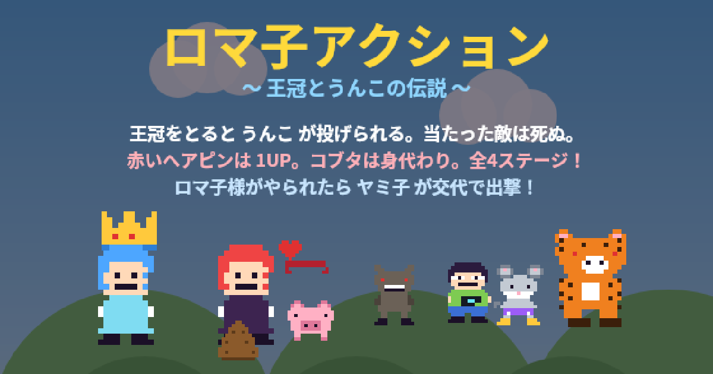

# ロマ子アクション 〜王冠とうんこの伝説〜

ブラウザで遊べる、ファミコン風の横スクロールアクションゲームです。
HTMLファイル1つだけでできています（インストール不要・通信なし）。

## ▶ 遊ぶ

### **https://kurose45.github.io/my-site2/**

## 遊びかた

| したいこと | パソコン | スマホ |
|---|---|---|
| 移動 | ← → キー | 画面下の ◀ ▶ |
| ジャンプ | スペース / ↑ | 「ジャンプ」ボタン |
| うんこを投げる | X / Shift | 「💩なげる」ボタン |

- **ロマ子様**（青髪）が主人公。やられると**ヤミ子**（赤髪）が交代で出撃します
- 敵は踏んでも倒せます

### アイテム

| アイテム | 出しかた | 効果 |
|---|---|---|
| 👑 王冠 | ピンクの ♛ ブロックを下から叩く | 💩 が投げられるようになる。当たった敵は退場 |
| ❤ 赤いヘアピン | 赤い ♥ ブロックを叩く | 1UP。残機が1つ増える |
| 🐷 コブタ | コブタの顔のブロックを叩く | ずっと後ろをついてくる。被弾すると「グェー死んだンゴ」と叫んで身代わりになってくれる（1回） |

### 敵

| 敵 | 特徴 |
|---|---|
| 二足歩行のオオカミ | うろうろ歩く。基本の敵 |
| カメラを持ったキモオタ | 立ち止まって赤く狙いをつけ、フラッシュを浴びせてくる。光る前に離れるか踏む |
| すばしこいネズミ | とても速い。身を沈めて溜めたあと猛ダッシュしてくる。倒すと高得点 |
| **二本足の虎（ボス）** | ステージ4の主。突進・跳びかかり（着地で落石）・咆哮で子分を呼ぶ。うんこ5発、または頭を5回踏むと撃破 |

### ステージ

1. **はじまりの草原** — 基本を覚えるステージ
2. **雲の上の王国** — 足場は雲だけ。落ちたら一巻の終わり
3. **大草原不可避** — 見わたす限りの草原。ネズミの群れが突進してくる
4. **虎の要塞** — 敵だらけの石造りの城。奥の玉座の間でボスの虎が待っている

ステージをクリアすると次のステージへ自動で続きます（スコアと残機は引き継ぎ）。4つ全部クリアで ALL CLEAR。

## 技術的なこと

- HTML + JavaScript + Canvas 2D のみ。ライブラリ・ビルド・サーバー不要
- キャラクターや背景はすべてコード内でドット絵として描画しています
- 外部への通信は一切ありません

## ライセンス

MIT License（`LICENSE` を参照）
